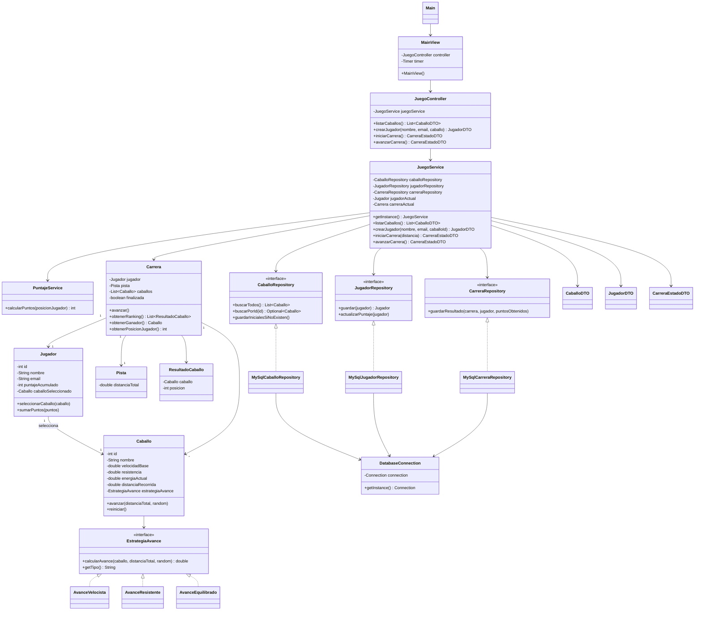

# Diagrama de clases

## Conceptos aplicados

- MVC: `MainView` es la vista, `JuegoController` coordina la entrada del usuario y las clases de `model` contienen el negocio.
- DTO: `CaballoDTO`, `JugadorDTO` y `CarreraEstadoDTO` transportan datos entre vista y controlador.
- Singleton: `JuegoService` centraliza el estado de la partida y `DatabaseConnection` centraliza la conexion JDBC.
- DAO: los repositorios separan el acceso a MySQL de las reglas de negocio.
- GRASP Information Expert: `Carrera` determina ranking, ganador y posicion porque conoce pista y caballos.
- SOLID OCP: las variantes de avance se agregan implementando `EstrategiaAvance`, sin modificar `Caballo`.
