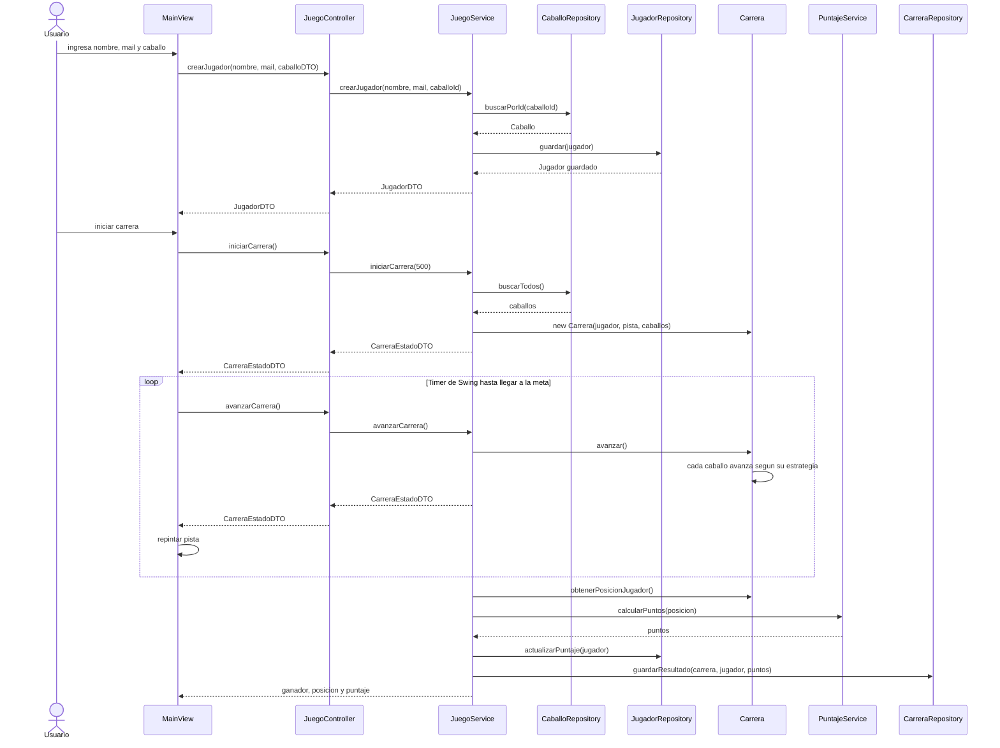
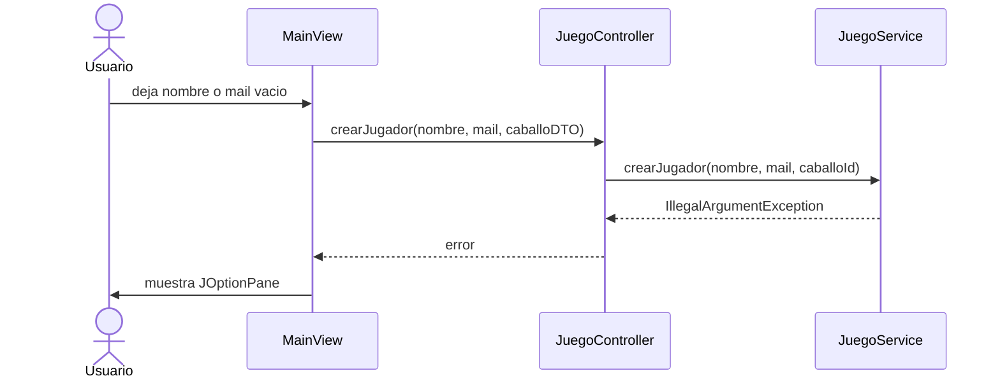

# Diagrama de secuencia

## Iniciar y finalizar carrera

```mermaid
sequenceDiagram
    actor Usuario
    participant Vista as MainView
    participant Controller as JuegoController
    participant Service as JuegoService
    participant CaballoRepo as CaballoRepository
    participant JugadorRepo as JugadorRepository
    participant Carrera as Carrera
    participant Puntaje as PuntajeService
    participant CarreraRepo as CarreraRepository

    Usuario->>Vista: ingresa nombre, mail y caballo
    Vista->>Controller: crearJugador(nombre, mail, caballoDTO)
    Controller->>Service: crearJugador(nombre, mail, caballoId)
    Service->>CaballoRepo: buscarPorId(caballoId)
    CaballoRepo-->>Service: Caballo
    Service->>JugadorRepo: guardar(jugador)
    JugadorRepo-->>Service: Jugador guardado
    Service-->>Controller: JugadorDTO
    Controller-->>Vista: JugadorDTO

    Usuario->>Vista: iniciar carrera
    Vista->>Controller: iniciarCarrera()
    Controller->>Service: iniciarCarrera(500)
    Service->>CaballoRepo: buscarTodos()
    CaballoRepo-->>Service: caballos
    Service->>Carrera: new Carrera(jugador, pista, caballos)
    Service-->>Controller: CarreraEstadoDTO
    Controller-->>Vista: CarreraEstadoDTO

    loop Timer de Swing hasta llegar a la meta
        Vista->>Controller: avanzarCarrera()
        Controller->>Service: avanzarCarrera()
        Service->>Carrera: avanzar()
        Carrera->>Carrera: cada caballo avanza segun su estrategia
        Service-->>Controller: CarreraEstadoDTO
        Controller-->>Vista: CarreraEstadoDTO
        Vista->>Vista: repintar pista
    end

    Service->>Carrera: obtenerPosicionJugador()
    Service->>Puntaje: calcularPuntos(posicion)
    Puntaje-->>Service: puntos
    Service->>JugadorRepo: actualizarPuntaje(jugador)
    Service->>CarreraRepo: guardarResultado(carrera, jugador, puntos)
    Service-->>Vista: ganador, posicion y puntaje
```

## Flujo secundario: error de validacion

```mermaid
sequenceDiagram
    actor Usuario
    participant Vista as MainView
    participant Controller as JuegoController
    participant Service as JuegoService

    Usuario->>Vista: deja nombre o mail vacio
    Vista->>Controller: crearJugador(nombre, mail, caballoDTO)
    Controller->>Service: crearJugador(nombre, mail, caballoId)
    Service-->>Controller: IllegalArgumentException
    Controller-->>Vista: error
    Vista->>Usuario: muestra JOptionPane
```
